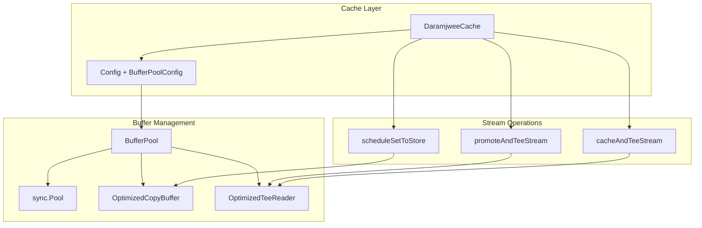

# Design Document

## Overview

이 설계는 daramjwee 캐시 시스템에서 io.Copy와 io.TeeReader의 버퍼 관리를 최적화하여 메모리 효율성을 개선하는 것을 목표로 합니다. sync.Pool을 활용한 버퍼 재사용을 통해 대규모 트래픽 환경에서 GC 압박을 줄이고 전체적인 성능을 향상시킵니다.

현재 시스템에서 io.Copy와 io.TeeReader는 내부적으로 32KB 크기의 버퍼를 매번 새로 할당합니다. 이는 높은 처리량 환경에서 빈번한 메모리 할당과 해제로 인한 GC 압박을 야기할 수 있습니다.

## Architecture

### 핵심 컴포넌트

1. **BufferPool**: sync.Pool을 래핑한 버퍼 관리자
2. **OptimizedCopyBuffer**: io.CopyBuffer를 사용한 최적화된 복사 함수
3. **OptimizedTeeReader**: 버퍼 풀을 사용하는 TeeReader 구현
4. **BufferPoolConfig**: 버퍼 풀 설정 옵션

### 아키텍처 다이어그램



## Components and Interfaces

### BufferPool Interface

```go
type BufferPool interface {
    // Get retrieves a buffer from the pool
    Get(size int) []byte
    
    // Put returns a buffer to the pool
    Put(buf []byte)
    
    // CopyBuffer performs optimized copy using pooled buffers
    CopyBuffer(dst io.Writer, src io.Reader) (int64, error)
    
    // TeeReader creates an optimized TeeReader using pooled buffers
    TeeReader(r io.Reader, w io.Writer) io.Reader
}
```

### BufferPoolConfig

```go
type BufferPoolConfig struct {
    // Enabled controls whether buffer pooling is active
    Enabled bool
    
    // DefaultBufferSize is the default buffer size for the pool
    DefaultBufferSize int
    
    // MaxBufferSize is the maximum buffer size to pool
    MaxBufferSize int
    
    // MinBufferSize is the minimum buffer size to pool
    MinBufferSize int
}
```

### DefaultBufferPool Implementation

```go
type DefaultBufferPool struct {
    config BufferPoolConfig
    pools  map[int]*sync.Pool // Size-based pools
    mutex  sync.RWMutex
}
```

## Data Models

### 버퍼 크기 전략

1. **Small Objects (< 4KB)**: 4KB 버퍼 사용
2. **Medium Objects (4KB - 64KB)**: 32KB 버퍼 사용 (기본값)
3. **Large Objects (> 64KB)**: 64KB 버퍼 사용

### 풀 관리 전략

- 각 크기별로 별도의 sync.Pool 유지
- 버퍼 크기가 임계값을 초과하면 풀에 반환하지 않음 (메모리 누수 방지)
- 사용 빈도가 낮은 크기의 풀은 주기적으로 정리

## Error Handling

### 에러 시나리오

1. **버퍼 풀 초기화 실패**: 기본 io.Copy/io.TeeReader로 폴백
2. **버퍼 할당 실패**: 표준 라이브러리 동작으로 폴백
3. **설정 검증 실패**: ConfigError 반환

### 폴백 메커니즘

```go
func (bp *DefaultBufferPool) CopyBuffer(dst io.Writer, src io.Reader) (int64, error) {
    if !bp.config.Enabled {
        return io.Copy(dst, src)
    }
    
    buf := bp.Get(bp.config.DefaultBufferSize)
    defer bp.Put(buf)
    
    return io.CopyBuffer(dst, src, buf)
}
```

## Testing Strategy

### 단위 테스트

1. **BufferPool 테스트**
   - 버퍼 할당/반환 정확성
   - 크기별 풀 관리
   - 동시성 안전성

2. **최적화된 함수 테스트**
   - CopyBuffer 정확성
   - TeeReader 동작 검증
   - 에러 처리 검증

### 성능 테스트

1. **벤치마크 테스트**
   - 버퍼 풀 사용 전후 성능 비교
   - 다양한 객체 크기별 성능 측정
   - 메모리 할당 패턴 분석

2. **스트레스 테스트**
   - 높은 동시성 환경에서 안정성 검증
   - 메모리 누수 검사
   - GC 압박 측정

### 통합 테스트

1. **캐시 시스템 통합**
   - promoteAndTeeStream 최적화 검증
   - cacheAndTeeStream 최적화 검증
   - 기존 API 호환성 확인

## Implementation Details

### 설정 통합

기존 Config 구조체에 BufferPoolConfig 추가:

```go
type Config struct {
    // ... existing fields
    BufferPool BufferPoolConfig
}
```

새로운 옵션 함수 추가:

```go
func WithBufferPool(enabled bool, defaultSize int) Option
func WithBufferPoolAdvanced(config BufferPoolConfig) Option
```

### 캐시 구현체 수정

DaramjweeCache에 BufferPool 필드 추가:

```go
type DaramjweeCache struct {
    // ... existing fields
    BufferPool BufferPool
}
```

### 최적화 적용 지점

1. **promoteAndTeeStream**: io.TeeReader → OptimizedTeeReader
2. **cacheAndTeeStream**: io.TeeReader → OptimizedTeeReader  
3. **scheduleSetToStore**: io.Copy → OptimizedCopyBuffer
4. **ScheduleRefresh**: io.Copy → OptimizedCopyBuffer

### 성능 모니터링

BufferPool에 통계 수집 기능 추가:

```go
type BufferPoolStats struct {
    TotalGets    int64
    TotalPuts    int64
    PoolHits     int64
    PoolMisses   int64
    ActiveBuffers int64
}
```

## Backward Compatibility

- 기존 API 인터페이스 완전 유지
- 버퍼 풀이 비활성화된 경우 기존 동작과 동일
- 설정 옵션은 선택적으로 제공
- 기본값은 안전한 설정으로 구성

## Performance Considerations

### 메모리 사용량

- 버퍼 풀 크기 제한으로 메모리 사용량 제어
- 사용하지 않는 버퍼의 주기적 해제
- 큰 버퍼의 풀링 제한으로 메모리 누수 방지

### CPU 오버헤드

- 풀 관리 오버헤드는 메모리 할당 비용보다 낮음
- 락 경합 최소화를 위한 크기별 풀 분리
- 빠른 경로 최적화 (풀 비활성화 시 직접 호출)

### 확장성

- 동시성 안전한 풀 구현
- 크기별 풀로 경합 분산
- 통계 수집의 원자적 연산 사용