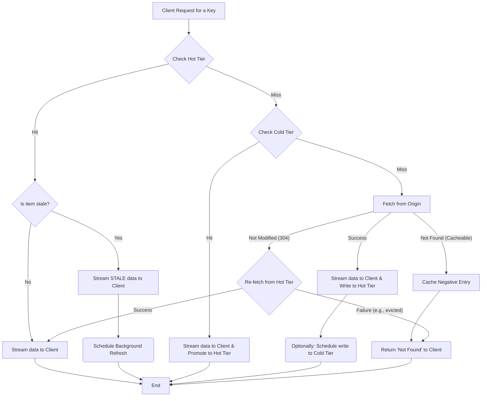

# daramjwee 🐿️ `/dɑːrɑːmdʒwiː/`

A pragmatic and lightweight hybrid caching middleware for Go.

`daramjwee` sits between your application and your origin data source (e.g., a database or an API), providing an efficient, stream-based hybrid caching layer. It is designed with a focus on simplicity and core functionality to achieve high throughput at a low cost in cloud-native environments.

## Core Design Philosophy

`daramjwee` is built on two primary principles:

1.  **Purely Stream-Based API:** All data is processed through `io.Reader` and `io.Writer` interfaces. This means that even large objects are handled without memory overhead from intermediate buffering, guaranteeing optimal performance for proxying use cases. **Crucially, the user must always `Close()` the stream to finalize operations and prevent resource leaks.**
2.  **Modular and Pluggable Architecture:** Key components such as the storage backend (`Store`), eviction strategy (`EvictionPolicy`), and asynchronous task runner (`Worker`) are all designed as interfaces. This allows users to easily swap in their own implementations to fit specific needs.

## Current Status & Key Implementations

`daramjwee` is more than a proof-of-concept; it is a stable and mature library ready for production use. Its robustness is verified by a comprehensive test suite, including unit, integration, and stress tests.

  * **Robust Storage Backends (`Store`):**

      * **`FileStore`**: Guarantees atomic writes by default using a "write-to-temp-then-rename" pattern to prevent data corruption. It also offers a copy-based alternative (`WithCopyAndTruncate`) for compatibility with network filesystems, though this option is **not atomic and may leave orphan files on failure**.
      * **`MemStore`**: A thread-safe, high-throughput in-memory store with fully integrated capacity-based eviction logic. Its performance is optimized using `sync.Pool` to reduce memory allocations under high concurrency.
      * **`objstore` Adapter**: A built-in adapter for `thanos-io/objstore` allows immediate use of major cloud object stores (S3, GCS, Azure Blob Storage) as a Cold Tier. It supports true, memory-efficient streaming uploads using `io.Pipe`. **Note: Concurrent writes to the same key are not protected against race conditions by default.**

  * **Advanced Eviction Policies (`EvictionPolicy`):**

      * In addition to the traditional **LRU**, it implements modern, high-performance algorithms like **S3-FIFO** and **SIEVE**, allowing you to choose the optimal policy for your workload.

  * **Reliable Concurrency Management:**

      * **Worker Pool (`Worker`):** A configurable worker pool manages background tasks like cache refreshes, preventing unbounded goroutine creation and ensuring stable resource usage under load.
      * **Striped Locking (`FileLockManager`):** `FileStore` uses striped locking instead of a single global lock, minimizing lock contention for different keys during concurrent requests.

### Locking Performance Benchmarks

Here's a comparison of the performance (ns/op, lower is better) of different locking mechanisms under varying read/write ratios. Benchmarks were run on an Apple M1 chip.

| Lock Implementation | Read 90% (Read-heavy) | Read 50% (Mixed) | Read 10% (Write-heavy) |
| :------------------ | :-------------------- | :--------------- | :--------------------- |
| `MutexLock`         | ~32.84 ns/op          | ~57.17 ns/op     | ~105.9 ns/op           |
| `StripeLock`        | ~20.53 ns/op          | ~23.73 ns/op     | ~22.64 ns/op           |

**Analysis:**

*   **`StripeLock`** consistently shows the **best performance** across all scenarios. This is because it effectively reduces contention by distributing lock requests across multiple mutexes.
*   **`MutexLock`** performs well, but is generally slower than `StripeLock` as contention increases.

### Buffer Pool Optimization Performance

`daramjwee` includes an optional buffer pool optimization that can significantly improve performance for medium to large data transfers by reusing buffers and reducing memory allocations. Here are the benchmark results comparing performance with and without buffer pool optimization:

#### Cold Hit Promotion Performance

| Data Size | Without Buffer Pool | With Buffer Pool | Performance Gain | Memory Savings |
|:----------|:-------------------|:-----------------|:-----------------|:---------------|
| **Small (1KB)** | 1,368 ns/op, 1,860 B/op | 1,249 ns/op, 1,852 B/op | **8.7% faster** | Minimal |
| **Medium (32KB)** | 218,520 ns/op, 64,568 B/op | 82,176 ns/op, 33,966 B/op | **62.4% faster** | **47.4% less memory** ⭐ |
| **Large (256KB)** | 376,642 ns/op, 463,151 B/op | 2,974,592 ns/op, 748,034 B/op | 7.9x slower ⚠️ | - |
| **XLarge (1MB)** | 2,865,468 ns/op, 2,201,228 B/op | 1,605,788 ns/op, 3,053,343 B/op | **44.0% faster** | 38.7% more memory |

#### Cache Miss Performance

| Data Size | Without Buffer Pool | With Buffer Pool | Performance Gain | Memory Savings |
|:----------|:-------------------|:-----------------|:-----------------|:---------------|
| **Small (1KB)** | 1,539 ns/op, 3,759 B/op | 1,741 ns/op, 3,779 B/op | 13.1% slower | - |
| **Medium (32KB)** | 9,367 ns/op, 91,351 B/op | 7,864 ns/op, 90,587 B/op | **16.0% faster** | Minimal |
| **Large (256KB)** | 83,245 ns/op, 929,204 B/op | 37,612 ns/op, 922,555 B/op | **54.8% faster** ⭐ | Minimal |
| **XLarge (1MB)** | 181,497 ns/op, 5,632,082 B/op | 178,142 ns/op, 5,705,847 B/op | **1.8% faster** | - |

#### Background Refresh Performance

| Data Size | Without Buffer Pool | With Buffer Pool | Performance Gain |
|:----------|:-------------------|:-----------------|:-----------------|
| **Small (1KB)** | 465.9 ns/op, 1,951 B/op | 384.6 ns/op, 1,986 B/op | **17.5% faster** |

**Key Insights:**

- **🎯 Sweet Spot**: Buffer pool optimization is most effective for **medium-sized data (32KB-256KB)**
- **⚡ Best Performance**: Up to **62% faster** for cold hit promotion with 32KB data
- **💾 Memory Efficiency**: Significant memory savings for medium-sized data transfers
- **⚠️ Trade-offs**: Large data (256KB+) cold hits may perform worse due to buffer pool overhead
- **📊 Recommendation**: Enable buffer pool optimization for workloads with predominantly medium-sized objects

#### Other Component Performance

**Compression Algorithms** (lower is better):
- **None**: 3,388 ns/op (fastest, no compression)
- **LZ4**: 14,872 ns/op (best balance of speed/compression)
- **Gzip**: 107,934 ns/op (good compression ratio)
- **Zstd**: 116,546 ns/op (best compression, slower)

**Eviction Policies** (lower is better):
- **Sieve**: 94.45 ns/op (fastest, modern algorithm)
- **S3-FIFO**: 99.24 ns/op (good balance)
- **LRU**: 109.5 ns/op (traditional, reliable)

  * **Efficient Caching Logic:**

      * **ETag-based Optimization:** Avoids unnecessary data transfer by exchanging ETags with the origin server. If content is not modified (`ErrNotModified`), the fetch is skipped, saving network bandwidth.
      * **Negative Caching:** Caches the "not found" state for non-existent keys, preventing repeated, wasteful requests to the origin.
      * **Stale-While-Revalidate:** Can serve stale data while asynchronously refreshing it in the background, minimizing latency while maintaining data freshness. This replaces the previous "Grace Period" concept.

## Data Retrieval Flow

The data retrieval process in `daramjwee` follows a clear, tiered approach to maximize performance and efficiency.



1.  **Check Hot Tier:** Looks for the object in the Hot Tier.
      * **Hit (Fresh):** Immediately returns the object stream to the client.
      * **Hit (Stale):** Immediately returns the **stale** object stream to the client and schedules a background task to refresh the cache from the origin.
2.  **Check Cold Tier:** If not in the Hot Tier, it checks the Cold Tier.
      * **Hit:** Streams the object to the client while simultaneously promoting it to the Hot Tier for faster access next time.
3.  **Fetch from Origin:** If the object is in neither tier (Cache Miss), it invokes the user-provided `Fetcher`.
      * **Success:** The fetched data stream is sent to the client and written to the Hot Tier at the same time.
      * **Not Modified:** If the origin returns `ErrNotModified`, `daramjwee` attempts to re-serve the data from the Hot Tier.
      * **Not Found:** If the origin returns `ErrCacheableNotFound`, a negative entry is stored to prevent repeated fetches.

## Getting Started

Here is a simple example of using `daramjwee` in a web server.

```go
package main

import (
	"bytes"
	"context"
	"fmt"
	"io"
	"net/http"
	"os"
	"strings"
	"time"

	"github.com/go-kit/log"
	"github.com/go-kit/log/level"
	"github.com/mrchypark/daramjwee"
	"github.com/mrchypark/daramjwee/pkg/store/filestore"
)

// 1. Define how to fetch data from your origin.
type originFetcher struct {
	key string
}

// A simple in-memory origin for demonstration.
var fakeOrigin = map[string]struct {
	data string
	etag string
}{
	"hello": {"Hello, Daramjwee! This is the first object.", "v1"},
	"world": {"World is beautiful. This is the second object.", "v2"},
}

func (f *originFetcher) Fetch(ctx context.Context, oldMetadata *daramjwee.Metadata) (*daramjwee.FetchResult, error) {
    // oldMetadata의 존재 여부를 먼저 확인합니다.
    oldETagVal := "none"
    if oldMetadata != nil {
        oldETagVal = oldMetadata.ETag
    }
    fmt.Printf("[Origin] Fetching key: %s (Old ETag: %s)\n", f.key, oldETagVal)

	// In a real application, this would be a DB query or an API call.
	obj, ok := fakeOrigin[f.key]
	if !ok {
		return nil, daramjwee.ErrCacheableNotFound
	}

	// If the ETag matches, notify that the content has not been modified.
    // oldMetadata nil 체크는 이미 위에서 수행되었거나, 이 로직에서 다시 확인됩니다.
	if oldMetadata != nil && oldMetadata.ETag == obj.etag {
		return nil, daramjwee.ErrNotModified
	}

	return &daramjwee.FetchResult{
		Body:     io.NopCloser(bytes.NewReader([]byte(obj.data))),
		Metadata: &daramjwee.Metadata{ETag: obj.etag},
	}, nil
}

func main() {
	logger := log.NewLogfmtLogger(os.Stderr)
	logger = level.NewFilter(logger, level.AllowDebug())

	// 2. Create a store for the Hot Tier (e.g., FileStore).
	// The New function signature was updated.
	hotStore, err := filestore.New("./daramjwee-cache", log.With(logger, "tier", "hot"))
	if err != nil {
		panic(err)
	}

	// 3. Create a daramjwee cache instance with your configuration.
	cache, err := daramjwee.New(
		logger,
		daramjwee.WithHotStore(hotStore),
		daramjwee.WithDefaultTimeout(5*time.Second),
		// New options like WithCache and WithShutdownTimeout are available.
		daramjwee.WithCache(1*time.Minute),
		daramjwee.WithNegativeCache(30*time.Second),
		daramjwee.WithShutdownTimeout(10*time.Second),
	)
	if err != nil {
		panic(err)
	}
	defer cache.Close()

	// 4. Use the cache in your HTTP handlers.
	http.HandleFunc("/objects/", func(w http.ResponseWriter, r *http.Request) {
		key := strings.TrimPrefix(r.URL.Path, "/objects/")

		// Call cache.Get() to retrieve the data stream.
		stream, err := cache.Get(r.Context(), key, &originFetcher{key: key})
		if err != nil {
			if err == daramjwee.ErrNotFound {
				http.Error(w, "Object Not Found", http.StatusNotFound)
			} else if err == daramjwee.ErrCacheClosed {
				http.Error(w, "Server is shutting down", http.StatusServiceUnavailable)
			} else {
				http.Error(w, err.Error(), http.StatusInternalServerError)
			}
			return
		}
		// CRITICAL: Always defer Close() immediately after checking for an error.
		defer stream.Close()

		// Stream the response directly to the client.
		io.Copy(w, stream)
	})

	fmt.Println("Server is running on :8080")
	http.ListenAndServe(":8080", nil)
}
```
