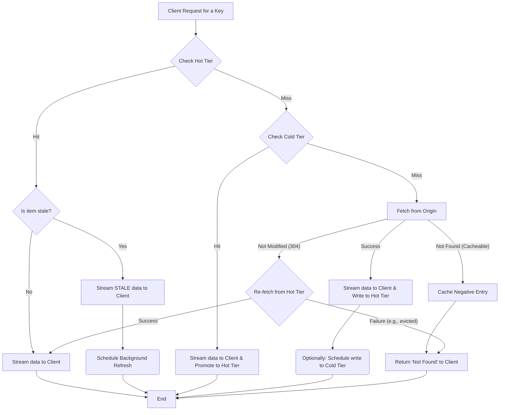

# daramjwee 🐿️ `/dɑːrɑːmdʒwiː/`

A pragmatic and lightweight hybrid caching middleware for Go.

`daramjwee` sits between your application and your origin data source (e.g., a database or an API), providing an efficient, stream-based hybrid caching layer. It is designed with a focus on simplicity and core functionality to achieve high throughput at a low cost in cloud-native environments.

## Core Design Philosophy

`daramjwee` is built on two primary principles:

1.  **Purely Stream-Based API:** All data is processed through `io.Reader` and `io.Writer` interfaces. This means that even large objects are handled without memory overhead from intermediate buffering, guaranteeing optimal performance for proxying use cases. **Crucially, the user must always `Close()` the stream to finalize operations and prevent resource leaks.**
2.  **Modular and Pluggable Architecture:** Key components such as the storage backend (`Store`), eviction strategy (`EvictionPolicy`), and asynchronous task runner (`Worker`) are all designed as interfaces. This allows users to easily swap in their own implementations to fit specific needs.

## Current Status & Key Implementations

`daramjwee` is more than a proof-of-concept; it is a stable and mature library ready for production use. Its robustness is verified by a comprehensive test suite, including unit, integration, and stress tests.

  * **Robust Storage Backends (`Store`):**

      * **`FileStore`**: Guarantees atomic writes by default using a "write-to-temp-then-rename" pattern to prevent data corruption. It also offers a copy-based alternative (`WithCopyAndTruncate`) for compatibility with network filesystems, though this option is **not atomic and may leave orphan files on failure**.
      * **`MemStore`**: A thread-safe, high-throughput in-memory store with fully integrated capacity-based eviction logic. Its performance is optimized using `sync.Pool` to reduce memory allocations under high concurrency.
      * **`objstore` Adapter**: A built-in adapter for `thanos-io/objstore` allows immediate use of major cloud object stores (S3, GCS, Azure Blob Storage) as a Cold Tier. It supports true, memory-efficient streaming uploads using `io.Pipe`. **Note: Concurrent writes to the same key are not protected against race conditions by default.**

  * **Advanced Eviction Policies (`EvictionPolicy`):**

      * In addition to the traditional **LRU**, it implements modern, high-performance algorithms like **S3-FIFO** and **SIEVE**, allowing you to choose the optimal policy for your workload.

  * **Reliable Concurrency Management:**

      * **Worker Pool (`Worker`):** A configurable worker pool manages background tasks like cache refreshes, preventing unbounded goroutine creation and ensuring stable resource usage under load.
      * **Striped Locking (`FileLockManager`):** `FileStore` uses striped locking instead of a single global lock, minimizing lock contention for different keys during concurrent requests.

  * **Efficient Caching Logic:**

      * **ETag-based Optimization:** Avoids unnecessary data transfer by exchanging ETags with the origin server. If content is not modified (`ErrNotModified`), the fetch is skipped, saving network bandwidth.
      * **Negative Caching:** Caches the "not found" state for non-existent keys, preventing repeated, wasteful requests to the origin.
      * **Stale-While-Revalidate:** Can serve stale data while asynchronously refreshing it in the background, minimizing latency while maintaining data freshness. This replaces the previous "Grace Period" concept.

## Data Retrieval Flow

The data retrieval process in `daramjwee` follows a clear, tiered approach to maximize performance and efficiency.



1.  **Check Hot Tier:** Looks for the object in the Hot Tier.
      * **Hit (Fresh):** Immediately returns the object stream to the client.
      * **Hit (Stale):** Immediately returns the **stale** object stream to the client and schedules a background task to refresh the cache from the origin.
2.  **Check Cold Tier:** If not in the Hot Tier, it checks the Cold Tier.
      * **Hit:** Streams the object to the client while simultaneously promoting it to the Hot Tier for faster access next time.
3.  **Fetch from Origin:** If the object is in neither tier (Cache Miss), it invokes the user-provided `Fetcher`.
      * **Success:** The fetched data stream is sent to the client and written to the Hot Tier at the same time.
      * **Not Modified:** If the origin returns `ErrNotModified`, `daramjwee` attempts to re-serve the data from the Hot Tier.
      * **Not Found:** If the origin returns `ErrCacheableNotFound`, a negative entry is stored to prevent repeated fetches.

## Getting Started

Here is a simple example of using `daramjwee` in a web server.

```go
package main

import (
	"bytes"
	"context"
	"fmt"
	"io"
	"net/http"
	"os"
	"strings"
	"time"

	"github.com/go-kit/log"
	"github.com/go-kit/log/level"
	"github.com/mrchypark/daramjwee"
	"github.com/mrchypark/daramjwee/pkg/store/filestore"
)

// 1. Define how to fetch data from your origin.
type originFetcher struct {
	key string
}

// A simple in-memory origin for demonstration.
var fakeOrigin = map[string]struct {
	data string
	etag string
}{
	"hello": {"Hello, Daramjwee! This is the first object.", "v1"},
	"world": {"World is beautiful. This is the second object.", "v2"},
}

func (f *originFetcher) Fetch(ctx context.Context, oldMetadata *daramjwee.Metadata) (*daramjwee.FetchResult, error) {
    // oldMetadata의 존재 여부를 먼저 확인합니다.
    oldETagVal := "none"
    if oldMetadata != nil {
        oldETagVal = oldMetadata.ETag
    }
    fmt.Printf("[Origin] Fetching key: %s (Old ETag: %s)\n", f.key, oldETagVal)

	// In a real application, this would be a DB query or an API call.
	obj, ok := fakeOrigin[f.key]
	if !ok {
		return nil, daramjwee.ErrCacheableNotFound
	}

	// If the ETag matches, notify that the content has not been modified.
    // oldMetadata nil 체크는 이미 위에서 수행되었거나, 이 로직에서 다시 확인됩니다.
	if oldMetadata != nil && oldMetadata.ETag == obj.etag {
		return nil, daramjwee.ErrNotModified
	}

	return &daramjwee.FetchResult{
		Body:     io.NopCloser(bytes.NewReader([]byte(obj.data))),
		Metadata: &daramjwee.Metadata{ETag: obj.etag},
	}, nil
}

func main() {
	logger := log.NewLogfmtLogger(os.Stderr)
	logger = level.NewFilter(logger, level.AllowDebug())

	// 2. Create a store for the Hot Tier (e.g., FileStore).
	// The New function signature was updated.
	hotStore, err := filestore.New("./daramjwee-cache", log.With(logger, "tier", "hot"))
	if err != nil {
		panic(err)
	}

	// 3. Create a daramjwee cache instance with your configuration.
	cache, err := daramjwee.New(
		logger,
		daramjwee.WithHotStore(hotStore),
		daramjwee.WithDefaultTimeout(5*time.Second),
		// New options like WithCache and WithShutdownTimeout are available.
		daramjwee.WithCache(1*time.Minute),
		daramjwee.WithNegativeCache(30*time.Second),
		daramjwee.WithShutdownTimeout(10*time.Second),
	)
	if err != nil {
		panic(err)
	}
	defer cache.Close()

	// 4. Use the cache in your HTTP handlers.
	http.HandleFunc("/objects/", func(w http.ResponseWriter, r *http.Request) {
		key := strings.TrimPrefix(r.URL.Path, "/objects/")

		// Call cache.Get() to retrieve the data stream.
		stream, err := cache.Get(r.Context(), key, &originFetcher{key: key})
		if err != nil {
			if err == daramjwee.ErrNotFound {
				http.Error(w, "Object Not Found", http.StatusNotFound)
			} else if err == daramjwee.ErrCacheClosed {
				http.Error(w, "Server is shutting down", http.StatusServiceUnavailable)
			} else {
				http.Error(w, err.Error(), http.StatusInternalServerError)
			}
			return
		}
		// CRITICAL: Always defer Close() immediately after checking for an error.
		defer stream.Close()

		// Stream the response directly to the client.
		io.Copy(w, stream)
	})

	fmt.Println("Server is running on :8080")
	http.ListenAndServe(":8080", nil)
}
```

goos: linux
```

=== RUN   TestCache_Get_FullMiss
--- PASS: TestCache_Get_FullMiss (0.00s)
=== RUN   TestCache_Get_ColdHit
--- PASS: TestCache_Get_ColdHit (0.00s)
=== RUN   TestCache_StaleHit_ServesStaleWhileRefreshing
--- PASS: TestCache_StaleHit_ServesStaleWhileRefreshing (0.00s)
=== RUN   TestCache_NegativeCache_On_ErrCacheableNotFound
--- PASS: TestCache_NegativeCache_On_ErrCacheableNotFound (0.00s)
=== RUN   TestCache_NegativeCache_StaleHit
--- PASS: TestCache_NegativeCache_StaleHit (0.00s)
=== RUN   TestCache_Get_FetcherError
--- PASS: TestCache_Get_FetcherError (0.00s)
=== RUN   TestCache_Get_ContextCancellation
--- PASS: TestCache_Get_ContextCancellation (0.05s)
=== RUN   TestCache_Set_Directly
--- PASS: TestCache_Set_Directly (0.00s)
=== RUN   TestCache_Delete
--- PASS: TestCache_Delete (0.00s)
=== RUN   TestCache_Close
--- PASS: TestCache_Close (0.05s)
=== RUN   TestCache_Get_NotModified_ButEvictedRace_Deterministic
--- PASS: TestCache_Get_NotModified_ButEvictedRace_Deterministic (0.00s)
=== RUN   TestCache_Concurrent_GetAndDelete
--- PASS: TestCache_Concurrent_GetAndDelete (0.00s)
=== RUN   TestCache_ReturnsError_AfterClose
--- PASS: TestCache_ReturnsError_AfterClose (0.00s)
=== RUN   TestMultiCloser_ClosesAll_EvenIfOneFails
--- PASS: TestMultiCloser_ClosesAll_EvenIfOneFails (0.00s)
=== RUN   TestCache_Get_ColdHit_PromotionFails
--- PASS: TestCache_Get_ColdHit_PromotionFails (0.00s)
=== RUN   TestCache_FreshForZero_AlwaysTriggersRefresh
=== RUN   TestCache_FreshForZero_AlwaysTriggersRefresh/PositiveCacheWithFreshForZero
=== RUN   TestCache_FreshForZero_AlwaysTriggersRefresh/NegativeCacheWithFreshForZero
--- PASS: TestCache_FreshForZero_AlwaysTriggersRefresh (0.20s)
    --- PASS: TestCache_FreshForZero_AlwaysTriggersRefresh/PositiveCacheWithFreshForZero (0.10s)
    --- PASS: TestCache_FreshForZero_AlwaysTriggersRefresh/NegativeCacheWithFreshForZero (0.10s)
=== RUN   TestNew_OptionValidation
=== RUN   TestNew_OptionValidation/Success_with_only_mandatory_hot_store
=== RUN   TestNew_OptionValidation/Success_with_all_options_valid
=== RUN   TestNew_OptionValidation/Success_with_positive_cache_TTL_of_zero
=== RUN   TestNew_OptionValidation/Success_with_negative_cache_TTL_of_zero
=== RUN   TestNew_OptionValidation/Failure_without_any_options
=== RUN   TestNew_OptionValidation/Failure_with_nil_HotStore
=== RUN   TestNew_OptionValidation/Failure_with_empty_worker_strategy
=== RUN   TestNew_OptionValidation/Failure_with_zero_worker_pool_size
=== RUN   TestNew_OptionValidation/Failure_with_negative_worker_pool_size
=== RUN   TestNew_OptionValidation/Failure_with_zero_worker_job_timeout
=== RUN   TestNew_OptionValidation/Failure_with_zero_default_timeout
=== RUN   TestNew_OptionValidation/Failure_with_negative_default_timeout
=== RUN   TestNew_OptionValidation/Failure_with_zero_shutdown_timeout
=== RUN   TestNew_OptionValidation/Failure_with_negative_shutdown_timeout
=== RUN   TestNew_OptionValidation/Failure_with_negative_value_for_positive_cache
=== RUN   TestNew_OptionValidation/Failure_with_negative_value_for_negative_cache
--- PASS: TestNew_OptionValidation (0.00s)
    --- PASS: TestNew_OptionValidation/Success_with_only_mandatory_hot_store (0.00s)
    --- PASS: TestNew_OptionValidation/Success_with_all_options_valid (0.00s)
    --- PASS: TestNew_OptionValidation/Success_with_positive_cache_TTL_of_zero (0.00s)
    --- PASS: TestNew_OptionValidation/Success_with_negative_cache_TTL_of_zero (0.00s)
    --- PASS: TestNew_OptionValidation/Failure_without_any_options (0.00s)
    --- PASS: TestNew_OptionValidation/Failure_with_nil_HotStore (0.00s)
    --- PASS: TestNew_OptionValidation/Failure_with_empty_worker_strategy (0.00s)
    --- PASS: TestNew_OptionValidation/Failure_with_zero_worker_pool_size (0.00s)
    --- PASS: TestNew_OptionValidation/Failure_with_negative_worker_pool_size (0.00s)
    --- PASS: TestNew_OptionValidation/Failure_with_zero_worker_job_timeout (0.00s)
    --- PASS: TestNew_OptionValidation/Failure_with_zero_default_timeout (0.00s)
    --- PASS: TestNew_OptionValidation/Failure_with_negative_default_timeout (0.00s)
    --- PASS: TestNew_OptionValidation/Failure_with_zero_shutdown_timeout (0.00s)
    --- PASS: TestNew_OptionValidation/Failure_with_negative_shutdown_timeout (0.00s)
    --- PASS: TestNew_OptionValidation/Failure_with_negative_value_for_positive_cache (0.00s)
    --- PASS: TestNew_OptionValidation/Failure_with_negative_value_for_negative_cache (0.00s)
=== RUN   TestNew_OptionOverrides
--- PASS: TestNew_OptionOverrides (0.00s)
=== RUN   TestNew_NilColdStoreIsValid
--- PASS: TestNew_NilColdStoreIsValid (0.00s)
goos: linux
goarch: amd64
pkg: github.com/mrchypark/daramjwee
cpu: AMD EPYC 7763 64-Core Processor                
BenchmarkCache_Get_HotHit
BenchmarkCache_Get_HotHit-4    	  528465	      2105 ns/op	    1476 B/op	      26 allocs/op
BenchmarkCache_Get_ColdHit
BenchmarkCache_Get_ColdHit-4   	  508917	      2091 ns/op	    1477 B/op	      26 allocs/op
BenchmarkCache_Get_Miss
BenchmarkCache_Get_Miss-4      	  307986	      3746 ns/op	    2082 B/op	      36 allocs/op
PASS
ok  	github.com/mrchypark/daramjwee	3.733s
?   	github.com/mrchypark/daramjwee/cmd/daramjwee	[no test files]
?   	github.com/mrchypark/daramjwee/examples	[no test files]
=== RUN   TestWorkerManager_NewManager
=== RUN   TestWorkerManager_NewManager/Pool_Strategy
=== RUN   TestWorkerManager_NewManager/All_Strategy
=== RUN   TestWorkerManager_NewManager/Invalid_Strategy_Should_Default_to_Pool
--- PASS: TestWorkerManager_NewManager (0.00s)
    --- PASS: TestWorkerManager_NewManager/Pool_Strategy (0.00s)
    --- PASS: TestWorkerManager_NewManager/All_Strategy (0.00s)
    --- PASS: TestWorkerManager_NewManager/Invalid_Strategy_Should_Default_to_Pool (0.00s)
=== RUN   TestWorkerManager_SubmitAndRun
--- PASS: TestWorkerManager_SubmitAndRun (0.00s)
=== RUN   TestWorkerManager_Shutdown_Success
--- PASS: TestWorkerManager_Shutdown_Success (0.05s)
=== RUN   TestWorkerManager_Shutdown_Timeout
--- PASS: TestWorkerManager_Shutdown_Timeout (0.10s)
=== RUN   TestWorkerManager_JobTimeout
--- PASS: TestWorkerManager_JobTimeout (0.01s)
=== RUN   TestWorkerPool_JobDroppingOnFullQueue
--- PASS: TestWorkerPool_JobDroppingOnFullQueue (0.06s)
=== RUN   TestShutdown_WithFullQueue
--- PASS: TestShutdown_WithFullQueue (0.00s)
=== RUN   TestPoolStrategy_DropsJob_WhenQueueIsFull_And_LogsIt
--- PASS: TestPoolStrategy_DropsJob_WhenQueueIsFull_And_LogsIt (0.05s)
PASS
ok  	github.com/mrchypark/daramjwee/internal/worker	0.275s
=== RUN   TestLRU_AddAndEvict
--- PASS: TestLRU_AddAndEvict (0.00s)
=== RUN   TestLRU_Touch
--- PASS: TestLRU_Touch (0.00s)
=== RUN   TestLRU_Remove
--- PASS: TestLRU_Remove (0.00s)
=== RUN   TestLRU_AddExisting
--- PASS: TestLRU_AddExisting (0.00s)
=== RUN   TestLRU_EdgeCases
--- PASS: TestLRU_EdgeCases (0.00s)
=== RUN   TestLRU_Churn
    lru_test.go:194: Churn test completed with final cache size: 100
--- PASS: TestLRU_Churn (0.00s)
=== RUN   TestS3FIFO_AddAndPromotion
--- PASS: TestS3FIFO_AddAndPromotion (0.00s)
=== RUN   TestS3FIFO_SecondChance
--- PASS: TestS3FIFO_SecondChance (0.00s)
=== RUN   TestS3FIFO_EvictFromSmallQueue
--- PASS: TestS3FIFO_EvictFromSmallQueue (0.00s)
=== RUN   TestS3FIFO_EvictFromMainQueue
--- PASS: TestS3FIFO_EvictFromMainQueue (0.00s)
=== RUN   TestS3FIFO_EvictFromMainWithSecondChance
--- PASS: TestS3FIFO_EvictFromMainWithSecondChance (0.00s)
=== RUN   TestS3FIFO_Remove
--- PASS: TestS3FIFO_Remove (0.00s)
=== RUN   TestS3FIFO_EdgeCases
--- PASS: TestS3FIFO_EdgeCases (0.00s)
=== RUN   TestS3FIFO_Churn
    s3fifo_test.go:260: S3-FIFO Churn test completed with final cache size: 100
--- PASS: TestS3FIFO_Churn (0.00s)
=== RUN   TestSievePolicy_BasicAddAndTouch
--- PASS: TestSievePolicy_BasicAddAndTouch (0.00s)
=== RUN   TestSievePolicy_AddExisting
--- PASS: TestSievePolicy_AddExisting (0.00s)
=== RUN   TestSievePolicy_Remove
--- PASS: TestSievePolicy_Remove (0.00s)
=== RUN   TestSievePolicy_Evict_MainScenario
--- PASS: TestSievePolicy_Evict_MainScenario (0.00s)
=== RUN   TestSievePolicy_Evict_FullRotation
--- PASS: TestSievePolicy_Evict_FullRotation (0.00s)
=== RUN   TestSievePolicy_EvictEmpty
--- PASS: TestSievePolicy_EvictEmpty (0.00s)
=== RUN   TestSievePolicy_EvictSingleItem
--- PASS: TestSievePolicy_EvictSingleItem (0.00s)
=== RUN   TestSievePolicy_RemoveHandledElement
--- PASS: TestSievePolicy_RemoveHandledElement (0.00s)
=== RUN   TestSievePolicy_Churn
--- PASS: TestSievePolicy_Churn (0.00s)
=== RUN   TestSievePolicy_Churn_Randomized
    sieve_test.go:265: SIEVE Churn test completed with final cache size: 100
--- PASS: TestSievePolicy_Churn_Randomized (0.00s)
goos: linux
goarch: amd64
pkg: github.com/mrchypark/daramjwee/pkg/policy
cpu: AMD EPYC 7763 64-Core Processor                
BenchmarkLRU_Churn
BenchmarkLRU_Churn-4      	 6991587	       157.9 ns/op	      57 B/op	       2 allocs/op
BenchmarkS3FIFO_Churn
BenchmarkS3FIFO_Churn-4   	 6661212	       169.7 ns/op	      64 B/op	       3 allocs/op
BenchmarkSieve_Churn
BenchmarkSieve_Churn-4    	 6845193	       180.4 ns/op	      61 B/op	       2 allocs/op
PASS
ok  	github.com/mrchypark/daramjwee/pkg/policy	4.024s
=== RUN   TestObjstoreAdapter_SetAndGetStream
--- PASS: TestObjstoreAdapter_SetAndGetStream (0.00s)
=== RUN   TestObjstoreAdapter_Stat
--- PASS: TestObjstoreAdapter_Stat (0.00s)
=== RUN   TestObjstoreAdapter_Delete
--- PASS: TestObjstoreAdapter_Delete (0.00s)
=== RUN   TestObjstoreAdapter_StreamingWriter_UploadError
--- PASS: TestObjstoreAdapter_StreamingWriter_UploadError (0.00s)
=== RUN   TestObjstoreAdapter_NegativeCache_NoBody
--- PASS: TestObjstoreAdapter_NegativeCache_NoBody (0.00s)
=== RUN   TestObjstoreAdapter_MetadataFields
--- PASS: TestObjstoreAdapter_MetadataFields (0.00s)
=== RUN   TestObjstoreAdapter_GoroutineLeakOnContextCancel
--- PASS: TestObjstoreAdapter_GoroutineLeakOnContextCancel (0.10s)
PASS
ok  	github.com/mrchypark/daramjwee/pkg/store/adapter	0.107s
=== RUN   TestFileStore_SetAndGet
--- PASS: TestFileStore_SetAndGet (0.00s)
=== RUN   TestFileStore_Get_NotFound
--- PASS: TestFileStore_Get_NotFound (0.00s)
=== RUN   TestFileStore_Stat
--- PASS: TestFileStore_Stat (0.00s)
=== RUN   TestFileStore_Delete
--- PASS: TestFileStore_Delete (0.00s)
=== RUN   TestFileStore_Overwrite
--- PASS: TestFileStore_Overwrite (0.00s)
=== RUN   TestFileStore_PathTraversal
--- PASS: TestFileStore_PathTraversal (0.00s)
=== RUN   TestFileStore_SetWithCopyAndTruncate
--- PASS: TestFileStore_SetWithCopyAndTruncate (0.00s)
=== RUN   TestFileStore_Set_ErrorOnFinalize_Rename
--- PASS: TestFileStore_Set_ErrorOnFinalize_Rename (0.00s)
=== RUN   TestFileStore_Set_ErrorOnFinalize_Copy
--- PASS: TestFileStore_Set_ErrorOnFinalize_Copy (0.00s)
=== RUN   TestFileStore_MetadataFields
--- PASS: TestFileStore_MetadataFields (0.00s)
goos: linux
goarch: amd64
pkg: github.com/mrchypark/daramjwee/pkg/store/filestore
cpu: AMD EPYC 7763 64-Core Processor                
BenchmarkFileStore_Set_RenameStrategy
BenchmarkFileStore_Set_RenameStrategy-4   	   13948	     83787 ns/op	    1209 B/op	      22 allocs/op
BenchmarkFileStore_Set_CopyStrategy
BenchmarkFileStore_Set_CopyStrategy-4     	   10000	    107948 ns/op	    1049 B/op	      26 allocs/op
BenchmarkFileStore_Get_RenameStrategy
BenchmarkFileStore_Get_RenameStrategy-4   	  114181	     10317 ns/op	     549 B/op	      16 allocs/op
BenchmarkFileStore_Get_CopyStrategy
BenchmarkFileStore_Get_CopyStrategy-4     	  113448	     10178 ns/op	     549 B/op	      16 allocs/op
PASS
ok  	github.com/mrchypark/daramjwee/pkg/store/filestore	7.176s
=== RUN   TestMemStore_SetAndGetStream
--- PASS: TestMemStore_SetAndGetStream (0.00s)
=== RUN   TestMemStore_Get_NotFound
--- PASS: TestMemStore_Get_NotFound (0.00s)
=== RUN   TestMemStore_Stat
--- PASS: TestMemStore_Stat (0.00s)
=== RUN   TestMemStore_Delete
--- PASS: TestMemStore_Delete (0.00s)
=== RUN   TestMemStore_Overwrite
--- PASS: TestMemStore_Overwrite (0.00s)
=== RUN   TestMemStore_Eviction
--- PASS: TestMemStore_Eviction (0.00s)
=== RUN   TestMemStore_PolicyIntegration
--- PASS: TestMemStore_PolicyIntegration (0.00s)
=== RUN   TestMemStore_Concurrency
--- PASS: TestMemStore_Concurrency (0.00s)
=== RUN   TestMemStore_Parallel
=== PAUSE TestMemStore_Parallel
=== RUN   TestMemStore_NegativeCache_NoBody
--- PASS: TestMemStore_NegativeCache_NoBody (0.00s)
=== RUN   TestMemStore_SetEmptyValue
--- PASS: TestMemStore_SetEmptyValue (0.00s)
=== RUN   TestMemStore_MetadataFields
--- PASS: TestMemStore_MetadataFields (0.00s)
=== RUN   TestMemStore_EvictionLoop_WithBadPolicy
--- PASS: TestMemStore_EvictionLoop_WithBadPolicy (0.00s)
=== CONT  TestMemStore_Parallel
=== RUN   TestMemStore_Parallel/group
=== RUN   TestMemStore_Parallel/group/Set-Get
=== PAUSE TestMemStore_Parallel/group/Set-Get
=== RUN   TestMemStore_Parallel/group/Stat
=== PAUSE TestMemStore_Parallel/group/Stat
=== RUN   TestMemStore_Parallel/group/Delete
=== PAUSE TestMemStore_Parallel/group/Delete
=== RUN   TestMemStore_Parallel/group/Set-New
=== PAUSE TestMemStore_Parallel/group/Set-New
=== CONT  TestMemStore_Parallel/group/Set-Get
=== CONT  TestMemStore_Parallel/group/Stat
=== CONT  TestMemStore_Parallel/group/Delete
=== CONT  TestMemStore_Parallel/group/Set-New
--- PASS: TestMemStore_Parallel (0.00s)
    --- PASS: TestMemStore_Parallel/group (0.00s)
        --- PASS: TestMemStore_Parallel/group/Set-Get (0.00s)
        --- PASS: TestMemStore_Parallel/group/Stat (0.00s)
        --- PASS: TestMemStore_Parallel/group/Delete (0.00s)
        --- PASS: TestMemStore_Parallel/group/Set-New (0.00s)
goos: linux
goarch: amd64
pkg: github.com/mrchypark/daramjwee/pkg/store/memstore
cpu: AMD EPYC 7763 64-Core Processor                
BenchmarkMemStore_ConcurrentReadWrite
BenchmarkMemStore_ConcurrentReadWrite-4   	 6665968	       179.2 ns/op	      64 B/op	       2 allocs/op
PASS
ok  	github.com/mrchypark/daramjwee/pkg/store/memstore	1.384s
```

## Benchmarks

```
goos: linux
goarch: amd64
pkg: github.com/mrchypark/daramjwee
cpu: AMD EPYC 7763 64-Core Processor                
BenchmarkCache_Get_HotHit-4    	  539539	      2106 ns/op	    1476 B/op	      26 allocs/op
BenchmarkCache_Get_ColdHit-4   	  535533	      2159 ns/op	    1476 B/op	      26 allocs/op
BenchmarkCache_Get_Miss-4      	  314084	      3692 ns/op	    2085 B/op	      36 allocs/op
PASS
ok  	github.com/mrchypark/daramjwee	3.851s
?   	github.com/mrchypark/daramjwee/cmd/daramjwee	[no test files]
?   	github.com/mrchypark/daramjwee/examples	[no test files]
PASS
ok  	github.com/mrchypark/daramjwee/internal/worker	0.275s
goos: linux
goarch: amd64
pkg: github.com/mrchypark/daramjwee/pkg/policy
cpu: AMD EPYC 7763 64-Core Processor                
BenchmarkLRU_Churn-4      	 6989918	       158.7 ns/op	      57 B/op	       2 allocs/op
BenchmarkS3FIFO_Churn-4   	 6558708	       169.6 ns/op	      64 B/op	       3 allocs/op
BenchmarkSieve_Churn-4    	 6900952	       181.7 ns/op	      61 B/op	       2 allocs/op
PASS
ok  	github.com/mrchypark/daramjwee/pkg/policy	4.031s
PASS
ok  	github.com/mrchypark/daramjwee/pkg/store/adapter	0.106s
goos: linux
goarch: amd64
pkg: github.com/mrchypark/daramjwee/pkg/store/filestore
cpu: AMD EPYC 7763 64-Core Processor                
BenchmarkFileStore_Set_RenameStrategy-4   	   13894	     84548 ns/op	    1209 B/op	      22 allocs/op
BenchmarkFileStore_Set_CopyStrategy-4     	   11193	    107884 ns/op	    1048 B/op	      26 allocs/op
BenchmarkFileStore_Get_RenameStrategy-4   	  116302	     10159 ns/op	     549 B/op	      16 allocs/op
BenchmarkFileStore_Get_CopyStrategy-4     	  114871	     10093 ns/op	     549 B/op	      16 allocs/op
PASS
ok  	github.com/mrchypark/daramjwee/pkg/store/filestore	8.461s
goos: linux
goarch: amd64
pkg: github.com/mrchypark/daramjwee/pkg/store/memstore
cpu: AMD EPYC 7763 64-Core Processor                
BenchmarkMemStore_ConcurrentReadWrite-4   	 6852753	       181.7 ns/op	      64 B/op	       2 allocs/op
PASS
ok  	github.com/mrchypark/daramjwee/pkg/store/memstore	1.429s
```
