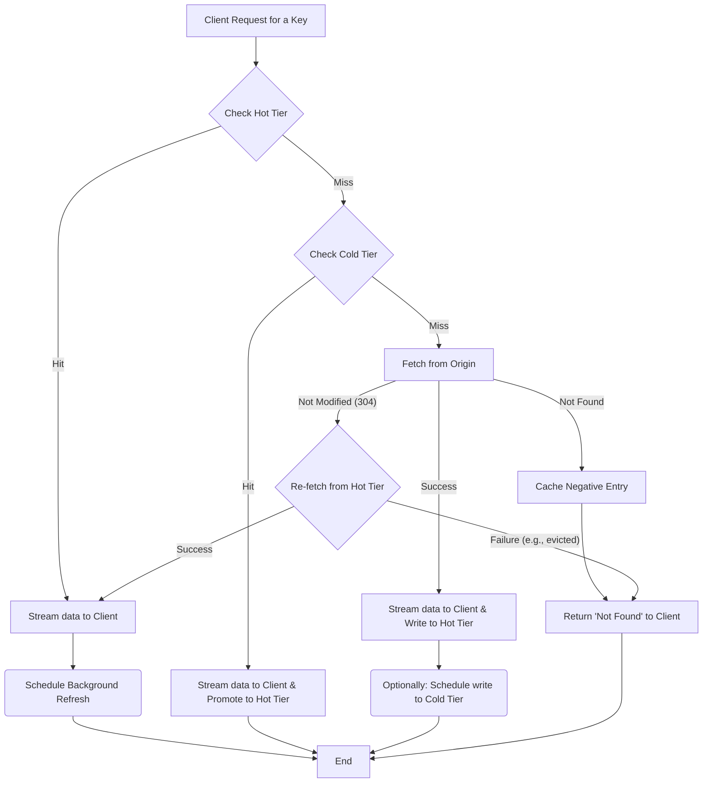

# daramjwee 🐿️ `/dɑːrɑːmdʒwiː/`

A pragmatic and lightweight hybrid caching middleware for Go.

`daramjwee` sits between your application and your origin data source (e.g., a database or an API), providing an efficient, stream-based hybrid caching layer. It is designed with a focus on simplicity and core functionality to achieve high throughput at a low cost in cloud-native environments.

## Core Design Philosophy

`daramjwee` is built on two primary principles:

1.  **Purely Stream-Based API:** All data is processed through `io.Reader` and `io.Writer` interfaces. This means that even large objects are handled without memory overhead from intermediate buffering, guaranteeing optimal performance for proxying use cases.

2.  **Modular and Pluggable Architecture:** Key components such as the storage backend (`Store`), eviction strategy (`EvictionPolicy`), and asynchronous task runner (`Worker`) are all designed as interfaces. This allows users to easily swap in their own implementations to fit specific needs.

## Current Status & Key Implementations

`daramjwee` is more than a proof-of-concept; it is a stable and mature library ready for production use. Its robustness is verified by a comprehensive test suite, including unit, integration, and stress tests.

  * **Robust Storage Backends (`Store`):**

      * **`FileStore`**: Guarantees atomic writes using a "write-to-temp-then-rename" pattern to prevent data corruption. It also offers a copy-based alternative (`WithCopyAndTruncate`) for compatibility with network filesystems like NFS.
      * **`MemStore`**: A thread-safe, high-throughput in-memory store with fully integrated capacity-based eviction logic.
      * **`objstore` Adapter**: A built-in adapter for `thanos-io/objstore` allows immediate use of major cloud object stores like AWS S3, Google Cloud Storage, and Azure Blob Storage as a Cold Tier. It supports true, memory-efficient streaming uploads using `io.Pipe`.

  * **Advanced Eviction Policies (`EvictionPolicy`):**

      * In addition to the traditional **LRU**, it implements modern, high-performance algorithms like **S3-FIFO** and **SIEVE**, allowing you to choose the optimal policy for your workload.

  * **Reliable Concurrency Management:**

      * **Worker Pool (`Worker`):** A configurable worker pool manages background tasks like cache refreshes, preventing unbounded goroutine creation and ensuring stable resource usage under load.
      * **Striped Locking (`FileLockManager`):** `FileStore` uses striped locking instead of a single global lock, minimizing lock contention for different keys during concurrent requests.

  * **Efficient Caching Logic:**

      * **ETag-based Optimization:** Avoids unnecessary data transfer by exchanging ETags with the origin server. If content is not modified (`ErrNotModified`), the fetch is skipped, saving network bandwidth.
      * **Negative Caching:** Caches the "not found" state for non-existent keys, preventing repeated, wasteful requests to the origin.
      * **Grace Period (Stale-While-Revalidate):** Can serve stale data for a configured grace period while asynchronously refreshing it in the background, minimizing latency while maintaining data freshness.

## Data Retrieval Flow

The data retrieval process in `daramjwee` follows a clear, tiered approach to maximize performance and efficiency.



1.  **Check Hot Tier:** Looks for the object in the Hot Tier.
      * **Hit:** Immediately returns the object stream to the client and schedules a background task to refresh the cache with the latest data from the origin.
2.  **Check Cold Tier:** If not in the Hot Tier, it checks the Cold Tier.
      * **Hit:** Streams the object to the client while simultaneously promoting it to the Hot Tier for faster access next time.
3.  **Fetch from Origin:** If the object is in neither tier (Cache Miss), it invokes the user-provided `Fetcher` to retrieve the data from the origin.
      * The fetched data stream is sent to the client and written to the Hot Tier at the same time.
      * A background job can be scheduled to also write the data to the Cold Tier.

## Getting Started

Here is a simple example of using `daramjwee` in a web server.

```go
package main

import (
	"bytes"
	"context"
	"fmt"
	"io"
	"net/http"
	"os"
	"strings"
	"time"

	"github.com/go-kit/log"
	"github.com/go-kit/log/level"
	"github.comcom/mrchypark/daramjwee"
	"github.com/mrchypark/daramjwee/pkg/store/filestore"
)

// 1. Define how to fetch data from your origin.
type originFetcher struct {
	key string
}

// A simple in-memory origin for demonstration.
var fakeOrigin = map[string]struct {
	data string
	etag string
}{
	"hello": {"Hello, Daramjwee! This is the first object.", "v1"},
	"world": {"World is beautiful. This is the second object.", "v2"},
}

func (f *originFetcher) Fetch(ctx context.Context, oldMetadata *daramjwee.Metadata) (*daramjwee.FetchResult, error) {
	oldETagVal := "none"
	if oldMetadata != nil {
		oldETagVal = oldMetadata.ETag
	}
	fmt.Printf("[Origin] Fetching key: %s (Old ETag: %s)\n", f.key, oldETagVal)

	// In a real application, this would be a DB query or an API call.
	obj, ok := fakeOrigin[f.key]
	if !ok {
		return nil, daramjwee.ErrNotFound
	}

	// If the ETag matches, notify that the content has not been modified.
	if oldMetadata != nil && oldMetadata.ETag == obj.etag {
		return nil, daramjwee.ErrNotModified
	}

	return &daramjwee.FetchResult{
		Body:     io.NopCloser(bytes.NewReader([]byte(obj.data))),
		Metadata: &daramjwee.Metadata{ETag: obj.etag},
	}, nil
}

func main() {
	logger := log.NewLogfmtLogger(os.Stderr)
	logger = level.NewFilter(logger, level.AllowDebug())

	// 2. Create a store for the Hot Tier (e.g., FileStore).
	hotStore, err := filestore.New("./daramjwee-cache", log.With(logger, "tier", "hot"))
	if err != nil {
		panic(err)
	}

	// 3. Create a daramjwee cache instance with your configuration.
	cache, err := daramjwee.New(
		logger,
		daramjwee.WithHotStore(hotStore),
		daramjwee.WithDefaultTimeout(5*time.Second),
		// Optionally add a ColdStore or custom Worker settings.
		// daramjwee.WithColdStore(coldStore),
		// daramjwee.WithWorker("pool", 20, 100, 1*time.Minute),
	)
	if err != nil {
		panic(err)
	}
	defer cache.Close()

	// 4. Use the cache in your HTTP handlers.
	http.HandleFunc("/objects/", func(w http.ResponseWriter, r *http.Request) {
		key := strings.TrimPrefix(r.URL.Path, "/objects/")

		// Call cache.Get() to retrieve the data stream.
		stream, err := cache.Get(r.Context(), key, &originFetcher{key: key})
		if err != nil {
			if err == daramjwee.ErrNotFound {
				http.Error(w, "Object Not Found", http.StatusNotFound)
			} else {
				http.Error(w, err.Error(), http.StatusInternalServerError)
			}
			return
		}
		defer stream.Close()

		// Stream the response directly to the client.
		io.Copy(w, stream)
	})

	fmt.Println("Server is running on :8080")
	http.ListenAndServe(":8080", nil)
}
```