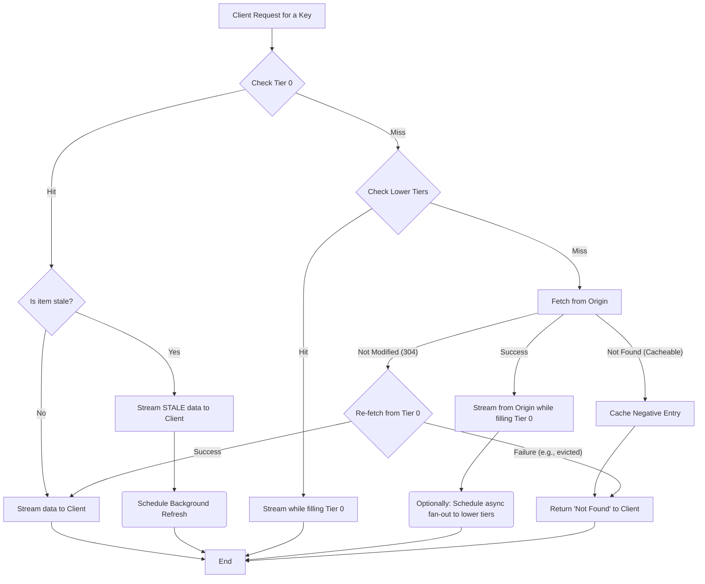

# daramjwee 🐿️ `/dɑːrɑːmdʒwiː/`

A pragmatic and lightweight hybrid caching middleware for Go.

`daramjwee` sits between your application and your origin data source (e.g., a database or an API), providing an efficient, stream-oriented hybrid caching layer. It is designed with a focus on simplicity and core functionality to achieve high throughput at a low cost in cloud-native environments.

## Core Design Philosophy

`daramjwee` is built on two primary principles:

1.  **Stream-Oriented API:** Public reads and writes are expressed through `io.Reader` and `io.Writer` interfaces, so store implementations can stream data without forcing full in-memory buffering in user code.

    Key semantics:
    - Callers must always `Close()` the returned stream to finalize the operation and release resources.
    - Tier-0 hits are returned directly as streams.
    - Lower-tier hits and origin misses are streamed to the caller while tier 0 is filled in the same read lifecycle.
    - If the caller stops early and closes the stream, the staged write is discarded instead of publishing partial data.
2.  **Modular and Pluggable Architecture:** Key components such as the storage backend (`Store`), eviction strategy (`EvictionPolicy`), and asynchronous task runner (`Worker`) are all designed as interfaces. This allows users to easily swap in their own implementations to fit specific needs.

## Current Status & Key Implementations

`daramjwee` is more than a proof-of-concept; it is a stable and mature library ready for production use. Its robustness is verified by a comprehensive test suite, including unit, integration, and stress tests.

  * **Robust Storage Backends (`Store`):**

      * **`FileStore`**: Guarantees atomic writes by default using a "write-to-temp-then-rename" pattern to prevent data corruption. It also offers a copy-based alternative (`WithCopyWrite`) for compatibility with network filesystems, though this option is **not atomic and may leave orphan files on failure**, and it is not supported as a top-tier (tier 0) store due to limitations with the stream-through publish contract.
      * **`MemStore`**: A thread-safe, high-throughput in-memory store with fully integrated capacity-based eviction logic. Its performance is optimized using `sync.Pool` to reduce memory allocations under high concurrency.
      * **`objectstore`**: A first-party `Store` for `thanos-io/objstore` providers (S3, GCS, Azure Blob Storage). It is designed for cost-efficient durable caching, especially when object count and large-object read cost matter, while still fitting into the same ordered-tier cache model as the other backends. Its local `dataDir` is an ingest/catalog workspace, not a persistent local read-cache tier. If you want durable remote backing plus local file-cache hits, place `FileStore` ahead of `objectstore` in `WithTiers(...)`. In distributed deployments, concurrent writes to the same key are still last-writer-wins unless you coordinate writers externally.

  * **Advanced Eviction Policies (`EvictionPolicy`):**

      * In addition to the traditional **LRU**, it implements modern, high-performance algorithms like **S3-FIFO** and **SIEVE**, allowing you to choose the optimal policy for your workload.

  * **Reliable Concurrency Management:**

      * **Worker Pool (`Worker`):** A configurable worker pool manages background tasks like cache refreshes, preventing unbounded goroutine creation and ensuring stable resource usage under load.
      * **Striped Locking (`FileLockManager`):** `FileStore` uses striped locking instead of a single global lock, minimizing lock contention for different keys during concurrent requests.

  * **Efficient Caching Logic:**

      * **CacheTag-based Optimization:** The cache tracks a cache-owned validator (`CacheTag`) for each representation. Origins can reuse it for conditional fetches, and applications can map it to external HTTP `ETag` headers if desired.
      * **Negative Caching:** Caches the "not found" state for non-existent keys, preventing repeated, wasteful requests to the origin.
      * **Stale-While-Revalidate:** Can serve stale data while asynchronously refreshing it in the background, minimizing latency while maintaining data freshness. This replaces the previous "Grace Period" concept.

## Data Retrieval Flow

The data retrieval process in `daramjwee` follows a clear, tiered approach to maximize performance and efficiency.


```mermaid
flowchart TD
    A[Client Request for a Key] --> B{Check Tier 0};

    B -- Hit --> C{Is item stale?};
    C -- No --> D[Stream data to Client];
    D --> E[End];
    C -- Yes --> F[Stream STALE data to Client];
    F --> G(Schedule Background Refresh);
    G --> E;

    B -- Miss --> H{Check Lower Tiers};

    H -- Hit --> I[Stream while filling Tier 0];
    I --> E;

    H -- Miss --> J[Fetch from Origin];
    J -- Success --> K[Stream from Origin while filling Tier 0];
    K --> L(Optionally: Schedule async fan-out to lower tiers);
    L --> E;
    
    J -- Not Found (Cacheable) --> M[Cache Negative Entry];
    M --> N[Return 'Not Found' to Client];
    N --> E;
    
    J -- Not Modified (304) --> O{Re-fetch from Tier 0};
    O -- Success --> D;
    O -- Failure (e.g., evicted) --> N;
```

1.  **Check Tier 0:** Looks for the object in the first regular tier.
      * **Hit (Fresh):** Immediately returns the object stream to the client.
      * **Hit (Stale):** Immediately returns the **stale** object stream to the client and schedules a background task to refresh the cache from the origin.
2.  **Check lower tiers:** If tier 0 misses, `daramjwee` checks the remaining ordered tiers.
      * **Hit:** Streams the object to the caller while simultaneously filling tier 0, so the next access is a tier-0 hit if the caller finishes and closes the stream.
3.  **Fetch from Origin:** If the object is in neither tier (Cache Miss), it invokes the user-provided `Fetcher`.
      * **Success:** The fetched data is streamed directly to the client while simultaneously filling tier 0. Once the read completes and the caller closes the stream, the entry becomes visible in tier 0 and can be fanned out asynchronously to lower tiers.
      * **Not Modified:** If the origin returns `ErrNotModified`, `daramjwee` attempts to re-serve the data from tier 0.
      * **Not Found:** If the origin returns `ErrCacheableNotFound`, a negative entry is stored to prevent repeated fetches.

## Getting Started

Here is a simple example of using `daramjwee` in a web server.

```go
package main

import (
	"bytes"
	"context"
	"fmt"
	"io"
	"net/http"
	"os"
	"strings"
	"time"

	"github.com/go-kit/log"
	"github.com/go-kit/log/level"
	"github.com/mrchypark/daramjwee"
	"github.com/mrchypark/daramjwee/pkg/store/filestore"
)

// 1. Define how to fetch data from your origin.
type originFetcher struct {
	key string
}

// A simple in-memory origin for demonstration.
var fakeOrigin = map[string]struct {
	data string
	etag string
}{
	"hello": {"Hello, Daramjwee! This is the first object.", "v1"},
	"world": {"World is beautiful. This is the second object.", "v2"},
}

func (f *originFetcher) Fetch(ctx context.Context, oldMetadata *daramjwee.Metadata) (*daramjwee.FetchResult, error) {
	oldCacheTag := "none"
	if oldMetadata != nil {
		oldCacheTag = oldMetadata.CacheTag
	}
	fmt.Printf("[Origin] Fetching key: %s (old CacheTag: %s)\n", f.key, oldCacheTag)

	// In a real application, this would be a DB query or an API call.
	obj, ok := fakeOrigin[f.key]
	if !ok {
		return nil, daramjwee.ErrCacheableNotFound
	}

	// If the CacheTag matches, notify that the content has not been modified.
	if oldMetadata != nil && oldMetadata.CacheTag == obj.etag {
		return nil, daramjwee.ErrNotModified
	}

	return &daramjwee.FetchResult{
		Body:     io.NopCloser(bytes.NewReader([]byte(obj.data))),
		Metadata: &daramjwee.Metadata{CacheTag: obj.etag},
	}, nil
}

func main() {
	logger := log.NewLogfmtLogger(os.Stderr)
	logger = level.NewFilter(logger, level.AllowDebug())

	// 2. Create the tier 0 store.
	tier0Store, err := filestore.New("./daramjwee-cache", log.With(logger, "tier", "0"))
	if err != nil {
		panic(err)
	}

	// 3. Create a daramjwee cache instance with ordered tiers.
	cache, err := daramjwee.New(
		logger,
		daramjwee.WithTiers(tier0Store),
		daramjwee.WithOpTimeout(5*time.Second),
		// This configures the default freshness for the ordered tier chain.
		daramjwee.WithFreshness(1*time.Minute, 30*time.Second),
		daramjwee.WithCloseTimeout(10*time.Second),
	)
	if err != nil {
		panic(err)
	}
	defer cache.Close()

	// 4. Use the cache in your HTTP handlers.
	http.HandleFunc("/objects/", func(w http.ResponseWriter, r *http.Request) {
		key := strings.TrimPrefix(r.URL.Path, "/objects/")

		// Call cache.Get() to retrieve the current cache decision.
		resp, err := cache.Get(r.Context(), key, daramjwee.GetRequest{
			IfNoneMatch: r.Header.Get("If-None-Match"),
		}, &originFetcher{key: key})
		if err != nil {
			if err == daramjwee.ErrCacheClosed {
				http.Error(w, "Server is shutting down", http.StatusServiceUnavailable)
			} else {
				http.Error(w, err.Error(), http.StatusInternalServerError)
			}
			return
		}
		defer resp.Close()

		if resp.Metadata.CacheTag != "" {
			w.Header().Set("ETag", resp.Metadata.CacheTag)
		}

		switch resp.Status {
		case daramjwee.GetStatusNotFound:
			http.Error(w, "Object Not Found", http.StatusNotFound)
			return
		case daramjwee.GetStatusNotModified:
			w.WriteHeader(http.StatusNotModified)
			return
		}

		// Stream the response directly to the client.
		io.Copy(w, resp)
	})

fmt.Println("Server is running on :8080")
http.ListenAndServe(":8080", nil)
}
```

## Freshness Configuration

`WithFreshness(...)` defines the
chain-wide default freshness policy for ordered tiers.

If a specific tier needs a different window, override just that tier index:

```go
cache, err := daramjwee.New(
    logger,
    daramjwee.WithTiers(memTier, fileTier, objectTier),
    daramjwee.WithFreshness(30*time.Second, 5*time.Second),
    daramjwee.WithTierFreshness(1, 5*time.Minute, 5*time.Second),
    daramjwee.WithTierFreshness(2, 30*time.Second, time.Minute),
)
```

Tier indexes follow the order passed to `WithTiers(...)`.
Because `WithTiers(...)` replaces the whole chain, it is best to define the
final tier list and any `WithTierFreshness(...)` overrides together in the same
`daramjwee.New(...)` call.

Background refresh jobs use the `"pool"` worker strategy by default. If you
need the old fire-one-goroutine-per-job behavior, set
`WithWorkerStrategy("all")` explicitly. Supported strategies are `"pool"` and
`"all"`; unknown strategy values now fail cache construction instead of silently
falling back to `"pool"`.

## Cache Groups

`New(...)` constructs a self-contained cache instance with its own background
runtime. That is the right choice when you want one cache to manage its own
worker lifecycle, shutdown behavior, and queue limits independently.

`NewGroup(...)` constructs a `CacheGroup` that owns one bounded shared
background runtime for multiple caches. Call `group.NewCache(...)` to create
cache instances that share that runtime while keeping their tier chains and
cache-local policy separate. Each grouped cache still closes independently, and
`group.Close()` first shuts down the shared runtime under the group close
timeout and then closes the created caches.

Group construction uses the `WithGroup...` option surface:

* `WithGroupWorkers(...)`
* `WithGroupWorkerTimeout(...)`
* `WithGroupWorkerQueueDefault(...)`
* `WithGroupCloseTimeout(...)`

Per-cache runtime tuning inside a group uses the regular cache options
`WithWeight(...)` and `WithQueueLimit(...)`. Those options only apply to caches
created from a `CacheGroup`; standalone `New(...)` construction keeps using the
original cache-level worker options such as `WithWorkers(...)`,
`WithWorkerQueue(...)`, `WithWorkerTimeout(...)`, and `WithWorkerStrategy(...)`.

Minimal example:

```go
group, err := daramjwee.NewGroup(
    logger,
    daramjwee.WithGroupWorkers(2),
    daramjwee.WithGroupWorkerQueueDefault(8),
)
if err != nil {
    panic(err)
}
defer group.Close()

users, err := group.NewCache(
    "users",
    daramjwee.WithTiers(memTier, fileTier),
    daramjwee.WithWeight(4),
    daramjwee.WithQueueLimit(16),
)
if err != nil {
    panic(err)
}
defer users.Close()
```

See [`examples/cache_group`](./examples/cache_group) for a runnable local demo.

## objectstore Configuration

`objectstore` exposes its behavior entirely through constructor options. There are two separate configuration layers:

- `daramjwee.WithTiers(...)` decides where `objectstore` sits in the ordered tier chain.
- `objectstore.With...(...)` options tune how the backend stores and reads remote objects.

The most important design point is that `objectstore.WithDir(...)` is **not** a user-visible file-cache tier. It stores local catalog state and flush spool data so the backend can stream writes efficiently to remote object storage. If the pod restarts with an empty directory, already-flushed remote entries can still be served from the remote checkpoint/segment state. If you want local filesystem read-cache behavior after restart, put `FileStore` in front of `objectstore`.

Typical ordered-tier layout:

```go
cache, err := daramjwee.New(
    logger,
    daramjwee.WithTiers(
        filestore.New("/var/lib/daramjwee/tier0", log.With(logger, "tier", "0")),
        objectstore.New(
            bucket,
            log.With(logger, "tier", "1"),
            objectstore.WithDir("/var/lib/daramjwee/objectstore"),
            objectstore.WithPrefix("prod/api-cache"),
            objectstore.WithPackThreshold(1<<20), // 1 MiB
            objectstore.WithPageSize(256<<10),            // 256 KiB
            objectstore.WithBlockCache(64<<20),     // 64 MiB
            objectstore.WithCheckpointCache(16<<20), // 16 MiB
            objectstore.WithCheckpointTTL(2*time.Second),
        ),
    ),
)
```

Recommended starting points:

- `WithPackThreshold(...)`
  - The main cost/performance knob for current `objectstore`.
  - Smaller than the threshold: packed into shared remote segment objects.
  - Larger than the threshold: uploaded as direct remote blobs.
  - Start with `512 KiB ~ 1 MiB` for `objectstore`-only tiers.
  - Start with `1 MiB ~ 2 MiB` when `FileStore` is in front and absorbs most hot reads.
- `WithDir(...)`
  - Local ingest/catalog workspace for the backend.
- `WithBlockCache(...)`
  - In-process payload block cache for packed remote reads.
- `WithCheckpointCache(...)`
  - In-process metadata cache for decoded shard checkpoints such as `latest.json`.
- `WithCheckpointTTL(...)`
  - Freshness window for the checkpoint metadata cache.

See [pkg/store/objectstore/README.md](pkg/store/objectstore/README.md) for a more detailed explanation of each option and suggested presets.
